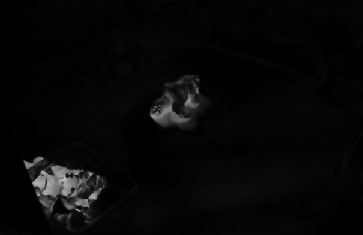
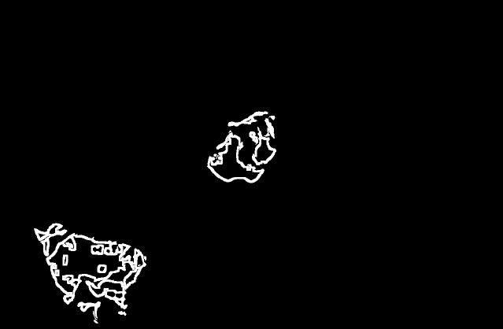
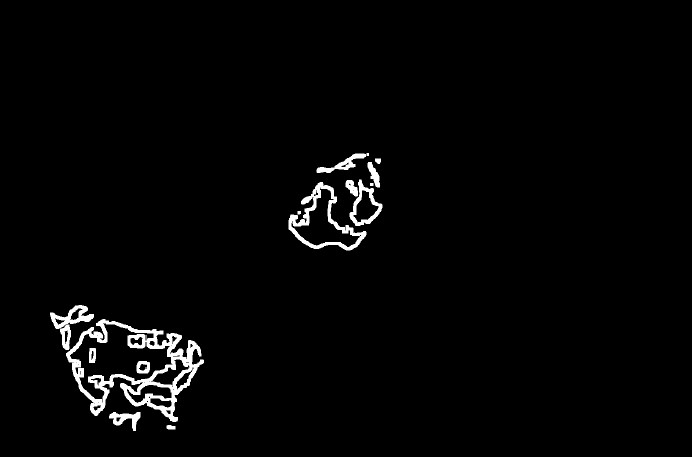
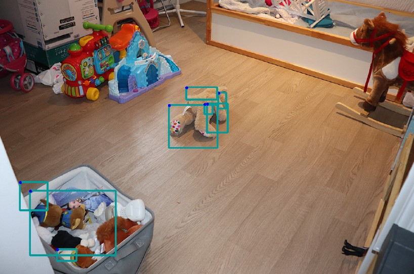
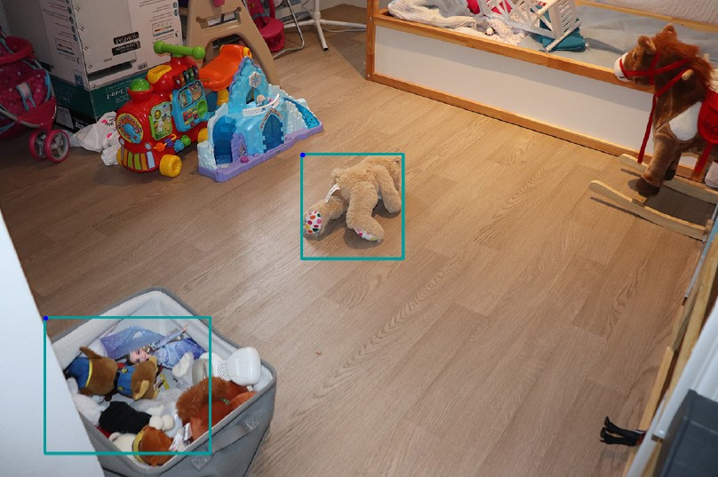
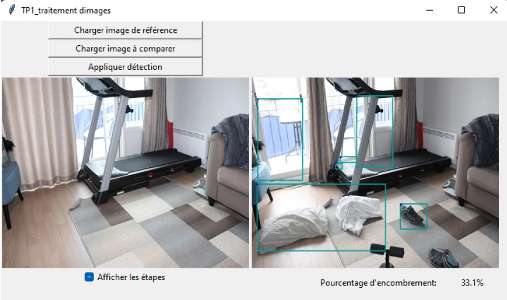

# TNI-UAQC

8INF804-Traitement numerique des images.
Hiver 2022
Professeur : Julien Lemaitre

Contributeurs
- Nihal OUHAOUADA 
- Pierre LACLAVERIE 
- Thibaud SIMON 
- Yann REYNAUD 

Ici le [Sujet](Sujet%20-%20TP1.pdf) ainsi que le [Compte-rendu](TP1_Traitement%20d'images.pdf)

Ce projet a ete fait en python avec notamment l'utilisation d'opencv.

# Sommaire

- [TNI-UAQC](#tni-uaqc)
- [Sommaire](#sommaire)
- [Objectif du travail](#objectif-du-travail)
  - [Presentation](#presentation)
  - [Mise en oeuvre](#mise-en-oeuvre)
- [Implementation](#implementation)
  - [Pretraitement](#pretraitement)
  - [Traitement](#traitement)
  - [Interface](#interface)

# Objectif du travail
## Presentation

Ce travail a veut l'elaboration d'un programme dans lequel, pour un set d'images donnees, calculer et afficher le taux de rangement d'une piece. Le taux de rangement d'une piece est la proportion a l'ecran d'objets qui ne sont pas a leur place. Il doit n'y avoir qu'un algorithme pour les gouverner tous.

Pour cela, une image de reference est donnee, ainsi qu'une serie d'autres images qui correspondent a la meme piece. Il y a trois pieces : la cuisine, le salon, la chambre.

## Mise en oeuvre
Pour repondre a cette demande, nous avons mis en place un algorithme en trois etapes :
1. Pretraitement
2. Traitement
3. Mise en forme

# Implementation

## Pretraitement

Au vu du probleme, nous avons choisit de faire un pretraitement en 4 sous etapes :
1. Egalisation
2. Floutage gaussien
3. Conversion en niveau de gris
4. Difference en valeur absolue avec l'image de reference.

L'egalisation permet de limiter les effets de l'eclairage sur les objets presents a l'ecran.

Le floutage gaussien permet de limiter l'impact des micros changement de la camera (en effet entre deux prises, il peut y avoir de legers ecart de rotation ou cadrage de la camera).

La conversion en niveau de gris permet de se liberer des contraintes de la couleur, en effet nous n'utilisons pas ces informations dans notre travail.

La difference en valeur absolue pernet d'avoir le residu pour avoir les changements entre les deux images = ce qui nous interesse.

Ici un exemple d'image apres ces pre-traitements

**Pre-traitement**

  

## Traitement
Pour extraire les informations qui nous interesse, on effectue :
1. Thresholding adaptatif
2. ImclearBorder
3. Ouverture morphologique
4. Bounding box
5. Rectangles englobants

Le thresholding adaptatif est un seuillage automatique permettant d'adapter le seuil en fonction de l'image .  La methode utilisee est le Mean-C car les elements du contours sont clairement definis. Pour un objet isole "trop petit" il sera renvoye sur le fond. Pour un "vrai" objet de taille assez grande, il sera correctement detecte et donc segmente.

Apres **thresholding**:

  

ImclearBorder est une fonction matlab que nous avons code en python, elle permet de supprimer tous les objets qui touchent les bords de l'image. En effet si nous les gardons ils peuvent fausser les resultats car peuvent etre mal detecte dans une image et bien detecte dans une autre donc nous avons choisit de les enlever. 

L'ouverture morphologique permet de supprimer les petits elements presents presents sur l'image (non visible car aux alentours de 1-3 pixels de ) Les residus de taille plus petite que le noyau seront effaces lors de l'erosion, les elements restants seront dilates pour retrouver leur taille d'origine.

**Ouverture Morphologique**

  

Le bounding box permet de cerner les objets qui nous interesse pour  mesurer le taux de rangement.

**Bounding Rect**

  

Nous avons implente une methode de rectangle englobant qui permet de creer un nouveau rectangle qui englobe deux autres rectangles si ces derniers s'intersectent. Ceci est particulierement utile dans le cas ou plusieurs parties d'un objet ont ete detectes independamment.

**Rectangles englobants**

  

## Interface

Nous avons choisit de presenter notre travail a l'aide d'une interface graphique.

Celle-ci permet de resumer l'ensemble des etapes et evite a l'utilisateur de voir le code... 

**Interface**

  

Contributeurs
Nihal OUHAOUADA 
Pierre LACLAVERIE 
Thibaud SIMON 
Yann REYNAUD 
